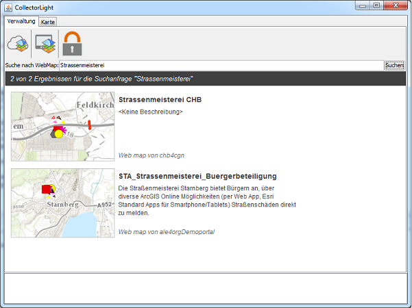
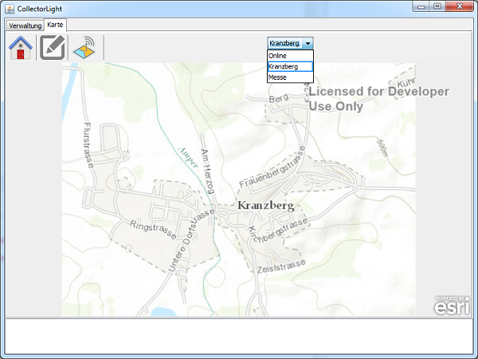

# **Collector Light Java**
Dieses Repository beinhaltet den Sourcecode einer Beispielanwendung auf Basis des ArcGIS Runtime SDK for Java. Es wird die Realisierung einiger Kernfunktionen des [Collector for ArcGIS](http://doc.arcgis.com/de/collector/ "") in einem weiteren ArcGIS Runtime SDK demonstriert.

## **Features**

* 2 Faktor Authentifizierung gegenüber ArcGIS Online
* Suchen von WebMaps auf ArcGIS Online
* Download von Basemaps und FeatureLayern
* Online und Offline Editierung
* Synchronisation von Änderungen

## **Instructions**
##### **Getting Started**

* Bei dem Beispiel handelt es sich um ein Eclipse Projekt. Damit dieses lauffähig ist, müssen die unter Ressourcen beschriebenen Bibliotheken eingebunden werden. Diese sind nicht Bestandteil des GitHub-Projekts.

* **Ändern AppID und Portal URL in data/config.properties**
Die Anwendung arbeitet mit Daten von ArcGIS Online. Deshalb ist es nötig die URL zu einer Subskription einzutragen. Außerdem muss die Anwendung in dieser Subskritpion [registeriert](http://doc.arcgis.com/de/arcgis-online/share-maps/add-items.htm#ESRI_SECTION1_55703F1EE9C845C3B07BBD85221FB074) werden. Als Elementtyp wählt man dabei "Anwendung" und die Redirect URI ist "urn:ietf:wg:oauth:2.0:oob".

##### **Anwenden der App**
Beim Starten der Anwendung kann man zunächst nach WebMaps suchen. Durch Klick auf einen Treffer in der Liste, wird diese Karte geöffnet. Alternativ kann man diese Aktion auch in der Liste, der bereits vorhandenen Offline-Karten ausführen.
#
In der Startansicht der Kartenkomponente hat man zunächst die Möglichkeit zwischen der WebMap und gegebenenfalls vorhandenen lokalen Kopien der WebMap zu wechseln. Im nächsten Reiter können die Daten sowohl Offline, als auch Online editiert werden. Im Synchronisations-Reiter besteht die Möglichkeit eine lokale Kopie der WebMap zu erstellen, lokale Änderungen zu synchronisieren und lokale Kopien wieder zu löschen.
#

##### **Hintergrundinformationen für Entwickler**

* **OAuth 2.0 User Login**
    Die Anwendung verwendet den [OAuth 2.0 User Login](https://developers.arcgis.com/java/guide/use-oauth-2-0-authentication.htm), um sich mit ArcGIS Online zu verbinden. Dabei handelt es sich um ein zweistufiges Authentifierzungsverfahren. Die Umsetzung ist in der Methode authorize in der Klasse *esride.samples.arcgisruntime.collectorlight.services.PortalConnector* beschrieben.
    
* **Lizenzierung** Für die [Lizenzierung](https://developers.arcgis.com/java/guide/license-your-app.htm) auf Basic Level, wird die AppID aus der Konfigurationsdatei data/config.properties verwendet. Da Offline-Funktionalität benutzt wird, ist auch eine Lizenzierung auf Standard Level nötig. Diese wird mit Hilfe von ArcGIS Online gemacht. Die Umsetzung hierfür findet man in der Klasse *esride.samples.arcgisruntime.collectorlight.services.LicenseManager*.

* **Download WebMap** Das Herunterladen der WebMap befindet sich in der Klasse *esride.samples.arcgisruntime.collectorlight.action.CreateOfflineProject*. Dabei werden sowohl die Hintergrundkarte, als auch die Features heruntergeladen. Für den Download der Hintergrundkarte wird ein Named User benötigt. Außerdem ist diese Operation nicht auf den Standardkarten möglich. Stattdessen muss folgende URL verwendet werden: http://tiledbasemaps.arcgis.com/arcgis/rest/services.

* **Synchronisation** Die Synchronisation der Daten findet man in der Klasse esride.samples.arcgisruntime.collectorlight.action.SyncProject.

* **Löschen der lokalen Kopie** Es ist wichtig vor dem löschen der lokalen Daten, einen unregister-Aufruf am FeatureService zu machen. Die Umsetzung befindet sich in der Klasse *esride.samples.arcgisruntime.collectorlight.action.DeleteProject*

## **Requirements**

[Unterstütze System-Konfiguration](https://developers.arcgis.com/java/guide/arcgis-runtime-sdk-for-java-system-requirements.htm)

## **Resources**

* [ArcGIS Runtime SDK for Java](https://developers.arcgis.com/java/ "")
    Sowohl, das SDK als auch das [Eclipse Plugin](https://developers.arcgis.com/java/guide/install-the-eclipse-plug-in.htm) sollten installiert sein.
* [Apache Commons Lang Bibliothek](http://commons.apache.org/proper/commons-lang/ "")

## **Issues**
Bei dem Code handelt es sich um Democode, der nicht vollständig ausprogrammiert und getestet ist. Es können Fehler auftreten, die nicht abgefangen sind.

## **Licensing**
Copyright 2014 Esri Deutschland GmbH

Licensed under the Apache License, Version 2.0 (the "License");
you may not use this file except in compliance with the License.
You may obtain a copy of the License at

   http://www.apache.org/licenses/LICENSE-2.0

Unless required by applicable law or agreed to in writing, software
distributed under the License is distributed on an "AS IS" BASIS,
WITHOUT WARRANTIES OR CONDITIONS OF ANY KIND, either express or implied.
See the License for the specific language governing permissions and
limitations under the License.

A copy of the license is available in the repository's LICENSE-2.0.txt file.

