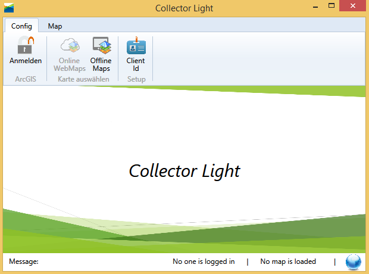

# **Collector Light Java**

Dieses Repository beinhaltet den Sourcecode von Beispielanwendungen auf Basis des ArcGIS Runtime SDK for Java und ArcGIS Runtime SDK for .NET/Desktop. Es wird die Realisierung einiger Kernfunktionen des [Collector for ArcGIS](http://doc.arcgis.com/de/collector/ "") in weiteren ArcGIS Runtime SDKs demonstriert.

Weiterführende Informationen befinden sich in den jeweiligen Projektordnern.

#
